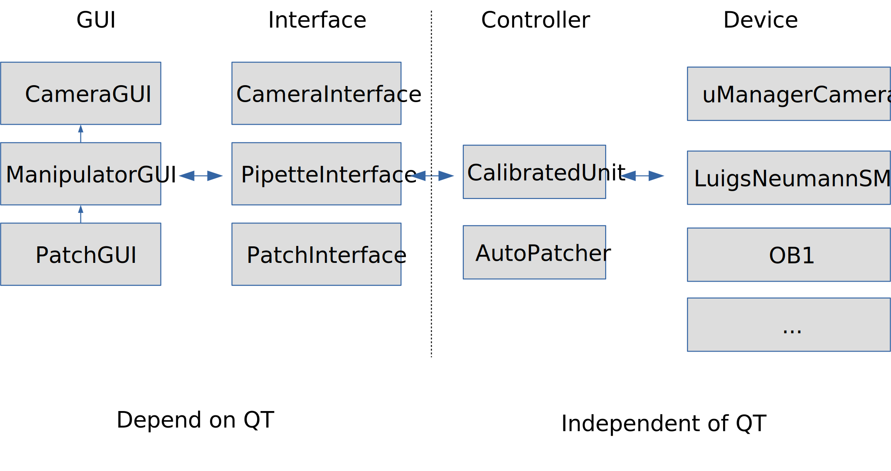

Developer guide
===============

.. contents::
    :local:
    :depth: 2

Code structure
--------------
The code has been separated into a "backend" part and a "frontend" part.

The backend part controls the hardware and implements the algorithms, e.g. what to
do to perform a patch clamp on a cell. This code has been written without using
any reference to ``Qt`` and can therefore be reused in simple scripts or in
interactive use for testing. However, the use of certain provided functions
makes it possible to tightly integrate the code with the GUI, most importantly
by making long-running tasks interruptable. For more information, see
:ref:`low_level_functionality` below.

The frontend is written based on the `Qt` libraries which not only provides the
graphical user interface (GUI) but also tools to run things in separate threads
and communicate via signals.

This basic structure is summarized in the figure below, showing the names of a
few of the most important classes:

GUI classes (first column)
~~~~~~~~~~~~~~~~~~~~~~~~~~
These classes provide the main window the user interacts with. It also defines
how the available commands defined in the interfaces (see below) are exposed,
e.g. via a Key press or a mouse click. See :ref:`gui_functionality` below for
more details. GUIs that show the camera image should inherit from
`.CameraGui` which not only provides the GUI for the basic camera image but also
an automatic help window, based on the configured mouse/key-bindings, and a
viewer for the log file. GUIs that want to expose control of the
micromanipulators should inherit from `.ManipulatorGui` (which itself inherits
from `.CameraGui`). Finally, the `.PatchGui` supports semi-automatic patch-clamp
recordings and itself inherits from `.ManipulatorGui`.

.. _interface_classes:

Interface classes (second column)
~~~~~~~~~~~~~~~~~~~~~~~~~~~~~~~~~
The interface classes provide the link between the GUI and the actual operations
defined in the controllers (see below). They all inherit from the
`.TaskInterface` class and declare and launch commands. Each command has to be
implemented in a method and annotated with either the `@command <.command>` or
the `@blocking_command <.blocking_command>` decorator. Non-blocking commands
(`@command <.command>`) are straightforward, short commands that have a direct
effect and should be executed from within the main thread. A typical example
would be a change in the exposure time of the camera, or storing the current
position of the microscope or the manipulators. Blocking commands
(`@blocking_command <.blocking_command>`) are commands that potentially take a
long time, such as moving the manipulators to a certain position, and should
not be interfered with. For example, during the movement of the manipulator all
other commands to move the manipulator should be ignored. To handle starting and
ending (potentially by a user abort) of such tasks correctly, the actual task
has to be implemented in one or several methods of a `.TaskController` (see
below). This method should not be called directly, but instead be called via
`.TaskInterface.execute` which will take care of handling errors and signalling
the completion of the task. For more details on this, see
:ref:`low_level_functionality` below.

Controller classes (third column)
~~~~~~~~~~~~~~~~~~~~~~~~~~~~~~~~~
These classes implement the actual tasks by calling the device classes (see
below), e.g. by stating that to patch, the cell has to move down until the
resistance changes, then set a negative pressure, etc. These classes should be
independent from the GUI (e.g. not rely on any ``Qt`` classes) so that they can
be used without it. However, they should inherit from the `.TaskController`
class and make use of its logging methods (`~.LoggingObject.debug`,
`~.LoggingObject.info`, etc.). By using these methods, messages will not only
use the general logging system, but also automatically check back whether the
user requested the task to be aborted and handle this situation. For more
details, see :ref:`low_level_functionality` below.

Device classes (fourth column)
~~~~~~~~~~~~~~~~~~~~~~~~~~~~~~
These classes expose the hardware functionality in a generic interface, so that
hardware can be exchanged without having to change code in the controller
classes (see above). By being built on generic classes, actual hardware can also
replaced by "fake" devices useful for development. For example, the generic
`.Camera` class states that all cameras have a `.Camera.snap` function that
returns the latest camera image. The `.FakeCamera` inherits from this class and
provides an implementation that returns an artificially generated camera image,
while the `.uManagerCamera` provides an implementation that returns an actual
microscope image via the MicroManager software.

Adding functionality
--------------------
In the following, we describe how to add various kinds of functionality to
existing or newly written classes.

.. _image_edit_funcs:

Post-processing the camera image
~~~~~~~~~~~~~~~~~~~~~~~~~~~~~~~~
In GUIs inherting from `.CameraGui` (which uses the `.LiveFeedQt` widget to
display the camera image), "image edit functions" can be used to post-process
the camera image. To add such a function, either call `.CameraGui`'s
`~.CameraGui.__init__` function with your post-processing function (or a list of
such functions) as an argument to its ``image_edit`` argument, or append to the
list stored in `~.CameraGui.image_edit_funcs` afterwards. The post-processing
function or method should take a single argument, the image as a numpy array,
and return the post-processed image. Such post-processing functions should only
be used to change the image in a way that needs the actual image information;
image-independent information that should simply be displayed on top should use
the mechanism described in :ref:`display_edit_funcs` below.

As an example, consider the following *autoscale* method that scales the
contrast of the image to span the full range. It can be implemented in a class
inheriting from `.CameraGui` as follows:

.. code:: Python

    def autoscale(self, image):
        # This assumes a 2D array, i.e. no colors
        if np.issubdtype(image.dtype, np.integer):
            info = np.iinfo(image.dtype)
            total_min, total_max = info.min, info.max
        else:
            total_min, total_max = 0.0, 1.0
        min_val, max_val = image.min(), image.max()
        range = (max_val - min_val)
        # Avoid overflow issues with integer types
        float_image = np.array(image, dtype=np.float64)
        new_image = (total_max - total_min)*(float_image - min_val)/range + total_min
        return np.array(new_image, dtype=image.dtype)

    def __init__(self, camera, ...):
        super(..., self).__init__(camera, image_edit=self.autoscale)

.. warning::
    Post-processing functions should not change the size and dtype of the image
    array, other code might directly asks the camera for the size of the video
    image and then e.g. scale overlays accordingly.

.. _display_edit_funcs:

Displaying information overlaid on the camera image
~~~~~~~~~~~~~~~~~~~~~~~~~~~~~~~~~~~~~~~~~~~~~~~~~~~
Similar to the image post-processing functions described above, classes
inheriting from `.CameraGui` can define "display edit functions" which can
directly draw on top of the camera image. In the same way as for the image
post-processing functions, such functions can be added by either providing them
as a ``display_edit`` argument to `.CameraGui.__init__` or by appending to its
`~.CameraGui.display_edit_funcs` attribute. Note that the former will overwrite
`.CameraGui`'s default overlay, i.e. the cross at the middle of the screen. The
overlay function receives a `.QPixmap` object and can paint on it using a
`.QPainter`. It should probably use some transparency to not cover the camera
image completely. As an example, the following, admittedly not very useful, code
will add a semi-transparent vertical blue line and write "left" and "right" in
its two halves:

.. code:: Python

    def show_halves(self, pixmap):
        painter = QtGui.QPainter(pixmap)
        pen = QtGui.QPen(QtGui.QColor(0, 0, 200, 125))  #blue, semi-transparent
        pen.setWidth(4)
        painter.setPen(pen)
        c_x, c_y = pixmap.width() / 2, pixmap.height() / 2
        painter.drawLine(c_x, 0, c_x, pixmap.height())
        painter.drawText(c_x / 2, c_y, 'left')
        painter.drawText(c_x + c_x / 2, c_y, 'right')
        painter.end()

    def __init__(self, camera, ...):
        super(..., self).__init__(camera)
        self.display_edit_funcs.append(self.show_halves)

Adding information to the status bar
~~~~~~~~~~~~~~~~~~~~~~~~~~~~~~~~~~~~
The status bar in all GUIs inheriting from `.CameraGui` automatically shows
long-running tasks or success/failure messages on its left. In principle, GUI
code (i.e. code running in the main thread) could show other temporary messages
there by calling the ``showMessage`` function of `.CameraGui`'s
`~.CameraGui.status_bar` attribute. The status bar also shows permanent messages
on the bottom right, e.g. which micromanipulator is currently in use. A class
can add additional information there by calling `.CameraGui.set_status_message`
which takes a category and a message as its argument. If this function is called
again with a new message for the same category, the previous message will be
overwritten. Such an update can be triggered regularly by using a
`~.QtCore.QTimer()`. For example, the following code will update the currently
use zoom factor every second by comparing the size of the displayed image
(in pixels) with the size of the camera image (a better solution for this use
case would be to have this update triggered by a size change instead of with a
regular timer).

.. code:: Python

    def __init__(self, camera, ...):
        super(..., self).__init__(camera)

        ...

        self.zoom_timer = QtCore.QTimer()
        self.zoom_timer.timeout.connect(self.set_zoom_status)
        self.zoom_timer.start(1000)

    def set_zoom_status(self):
        display_size = self.video.pixmap().width()
        image_size = self.camera.width
        zoom = 1.0*display_size/image_size
        self.set_status_message('Zoom', 'Zoom: {:3.0f}%'.format(zoom*100))

.. _gui_functionality:

Exposing existing functionality in the GUI
~~~~~~~~~~~~~~~~~~~~~~~~~~~~~~~~~~~~~~~~~~

If a functionality has been defined in the interface class (see
:ref:`interface_classes` above, and :ref:`low_level_functionality` below), it
can be exposed in the GUI. There are two standard methods which also take care
of integrating the function with the automatic help window:
`~.CameraGui.register_key_action` and `~.CameraGui.register_mouse_action`. By
convention, these functions should be called in an overwritten version of
`.CameraGui.register_commands` (which should normally call the parent
implementation). The first two arguments of these are the key (as a ``Qt``
constant, e.g. ``Qt.Key_X``), respectively the mouse button (e.g.
``Qt.RightButton``) and the modifier. The modifier can either be a
``Qt`` constant such as ``Qt.ShiftModifier`` to only trigger the action if the
modifier is pressed, or ``None`` if the action should be triggered independent
of the modifier. The modifier ``Qt.NoModifier`` should be used if the action
should only by triggered if the key or mouse button is pressed without any
modifier.

.. warning::
    Do not use ``Qt.KeypadModifier``, it will be automatically removed from the
    key event, in particular to avoid problems on OS X where all number key
    presses carry this modifier.

The third argument is the action to trigger, this should be a method of a
`.TaskInterface` annotated with `@command <.command>` or
`@blocking_command <.blocking_command>` (see :ref:`interface_classes`). Key
actions can take an additional ``argument``, this can be used to perform a
parametrized action, e.g. a move of a given size. Functions that are triggered
by mouse clicks automatically receive the mouse position in the camera image
(i.e. rescaled and independent of the window size on screen) as an argument.
Finally, the optional ``default_doc`` argument can be set to ``False`` to not
automatically document the action in the Help window. This can be useful when
registering many similar commands (e.g. moves of different directions/sizes);
they can be summarized with fewer custom help entries by calling
`.KeyboardHelpWindow.register_custom_action`.

.. _low_level_functionality:

Adding new low-level functionality
~~~~~~~~~~~~~~~~~~~~~~~~~~~~~~~~~~
Low-level functionality should be added in a `.TaskController` class. Such
classes should not use any ``Qt``-specific code, i.e. should stay independent
of the GUI. However, they should make use of the logging functions such as
`~.LoggingObject.debug` and `~.LoggingObject.info`, which will automatically
check for user-requested cancellations of a running task. Similarly, a task that
needs to wait (e.g. for a manipulator that is still moving), should use the
`.TaskController.sleep` method instead of Python's standard `~time.sleep`.

After adding such functionality, it should be exposed in the `.TaskInterface` by
adding a method annotated with `@command <.command>` or
`@blocking_command <.blocking_command>` (see :ref:`interface_classes`). Finally,
this method can then be linked to a keypress or a mouse click in the GUI (see
:ref:`gui_functionality`).

.. _image_acquisition:

Image acquisition
-----------------

Devices that provide images need to inherit from the `.Camera` class. This
includes classes that add support for microscopes (e.g. `~.LucamCamera`) as well as
classes that provide images for testing (e.g. `~.RecordedVideoCamera`). At the
end of the ``__init__`` method, a `.Camera` subclass has to call the
`.Camera.start_acquisition` method. This will create a thread that constantly
acquires new images from the device using its `Camera.snap` method. This
`~.AcquisitionThread` puts each image into a number of thread-safe queues (Python's
`deque` class) for use by other threads. By default, it puts the image into a
single queue of size 1 (i.e., the queue data structure is only used for thread
safety). This queue therefore always contains the last acquired image, and can be
used for all applications where it does not matter whether every frame has been
processed or not. In particular, this queue is used to display the camera image
on screen (`.LiveFeedQt`). For convenience, the image in this queue can be
accessed via the `.Camera.last_frame` method which returns the frame number and
the frame itself. The frame number can be used to check whether the image has
changed since the last call. For example, `.LiveFeedQt` updates its display
every 50ms, but will only call the ``image_edit`` functions
(see :ref:`above <image_edit_funcs>`) if the frame number changed.

The `.Camera.start_recording` method starts an additional thread
(`~.FileWriteThread`), and creates a new queue with a configurable size. The
`~.FileWriteThread` will take and remove frames from one end of the queue and
write them to disk, while the `~.AcquisitionThread` adds new images on the
other end. This way, the `~.FileWriteThread` will not skip any image, even
if it is not always fast enough to write the image to disk before a new image
is acquired.